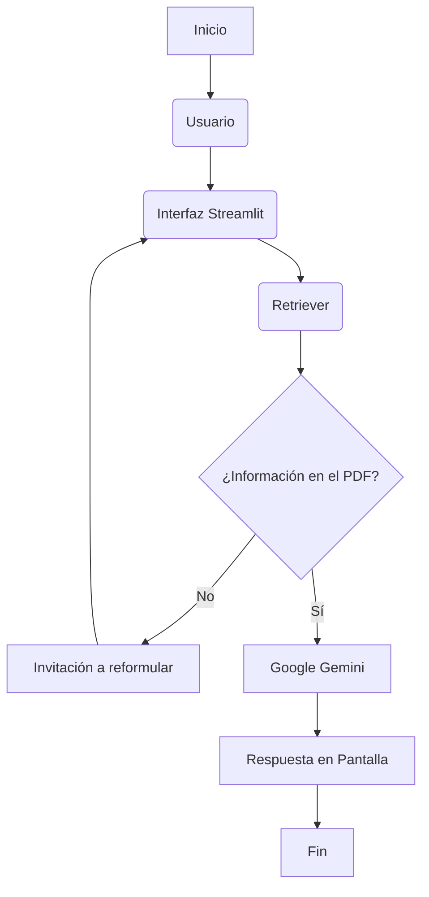

# Clínica Integral SaludPlus 🏥

Este proyecto implementa un sistema **RAG (Retrieval-Augmented Generation)** que responde preguntas utilizando exclusivamente la documentación interna (Manual de Operaciones, Políticas y Guías integrales) de la empresa ficticia **Clínica Integral SaludPlus**.

El aplicativo resuelve consultas sobre: políticas de privacidad, derechos ARCO, consultas y turnos, entrega de resultados, políticas de cancelación, devoluciones, convenios, alertas de seguridad, directorio de sedes regionales, catálogo de medicamentos exclusivos, costos de servicios, horarios, facturación electrónica, traslados en ambulancia, descuentos especiales y guía de admisión.

---

## 🎯 Objetivo

Desarrollar e implementar un asistente virtual capaz de:
* **Consultar** documentación interna estructurada en formato PDF.
* **Analizar** el documento de forma semántica para extraer la respuesta correcta.
* **Generar** respuestas fundamentadas estrictamente en dicho documento.
* **Evitar** alucinaciones o respuestas inventadas si la información no existe en el archivo.

---

## 📈 Estado del Proyecto

* **Estado:** Finalizado, desplegado y en producción. 🚀

---

## ⚡ Características

* **Lectura de PDFs:** Procesa el Manual de Operaciones, Políticas y Guías Integrales.
* **Generación Avanzada:** Respuestas potenciadas por los modelos de Google Gemini.
* **Restricción de Contexto:** Respuestas basadas *únicamente* en la información del PDF.
* **Interfaz de Usuario:** Entorno web amigable desarrollado con Streamlit.

---

## 🏗️ Arquitectura y Flujo

El sistema se basa en una arquitectura RAG estándar. Si la pregunta del usuario no encuentra coincidencia en el PDF, el sistema lo detecta y le invita a reformular su consulta.



---

## 🛠️ Tecnologías Utilizadas

* **Lenguaje:** Python 3.14.6
* **Frontend:** Streamlit
* **Orquestación LLM:** LangChain
* **Modelo Inteligencia Artificial:** Google Gemini
* **Gestión de Entorno:** Python-dotenv

---

## ⚙️ Instalación

Sigue estos pasos para configurar el proyecto en tu entorno local:

1. **Clonar el repositorio:**
   ```bash
   git clone https://github.com/miramar1974/orquestador-pdf
   ```

2. **Ingresar al directorio del proyecto:**
   ```bash
   cd orquestador-pdf
   ```

3. **Crear un entorno virtual:**
   ```bash
   python -m venv .venv
   ```

4. **Activar el entorno virtual:**
   * en Windows:
     ```bash
     .venv\Scripts\activate
     ```
   * En Linux/macOS:
     ```bash
     source .venv/bin/activate
     ```

5. **Instalar las dependencias:**
   ```bash
   pip install -r requirements.txt
   ```

6. **Configurar las variables de entorno:**
   Crea un archivo llamado `.env` en la raíz del proyecto y agrega tu clave de API de Gemini:
   ```env
   GEMINI_API_KEY=tu_clave_api_key_aquí
   ```

---

## 🚀 Ejecución

Una vez instaladas las dependencias y configurada tu API Key, inicializa la aplicación con el siguiente comando:

```bash
streamlit run app_web.py
```

Inmediatamente se abrirá tu explorador web con la interfaz gráfica para comenzar a interactuar.

---

## 💡 Ejemplos de Consultas

Puedes probar el sistema realizando preguntas como:
* ¿Costo de consultas?
* ¿Reembolsos?
* ¿Agendar consultas?
* ¿Traslados en ambulancia?
* ¿Política de privacidad del paciente?
* ¿Entrega de resultados?
* ¿Política de cancelaciones?
* ¿Devoluciones?
* ¿Guía de convenios?
* ¿Sedes alternas?
* ¿Costo de imagenología avanzada?
* ¿Facturación electrónica?
* ¿Política de descuentos?
* ¿Guía de admisión?
* ¿Protocolos de alta médica?

---

## 📸 Capturas de Pantalla

*(Coloca aquí las imágenes de tu aplicación si lo deseas)*
<!-- Ejemplo:  -->

---

## ✒️ Autor

* **Miguel Ibarra Miramar** - [GitHub](https://github.com/miramar1974)
