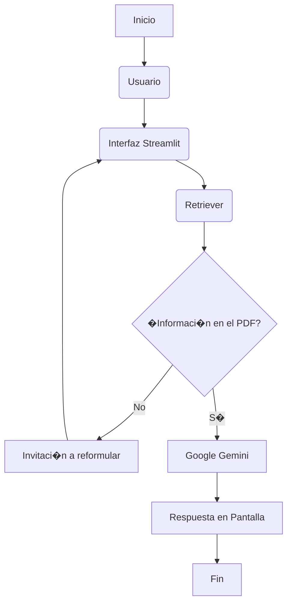
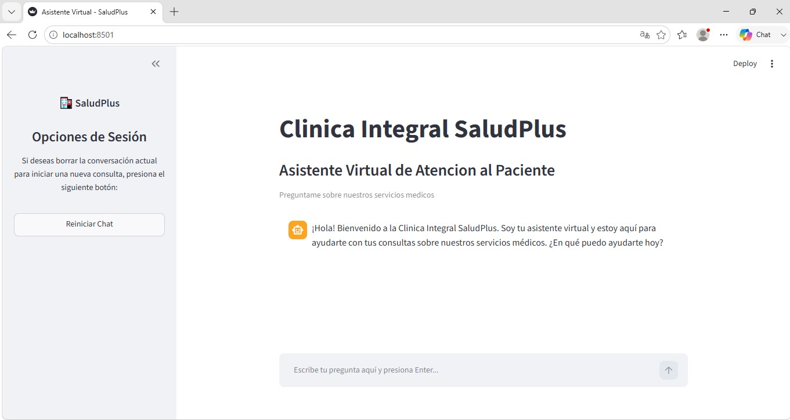
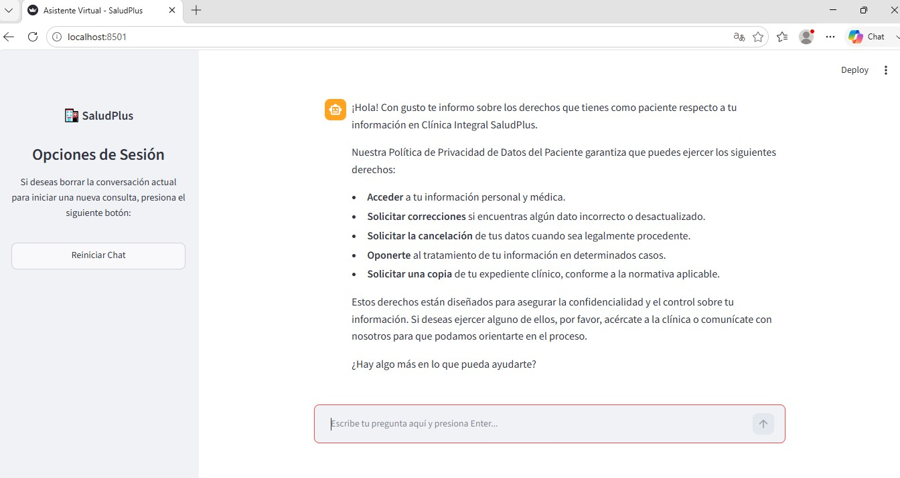
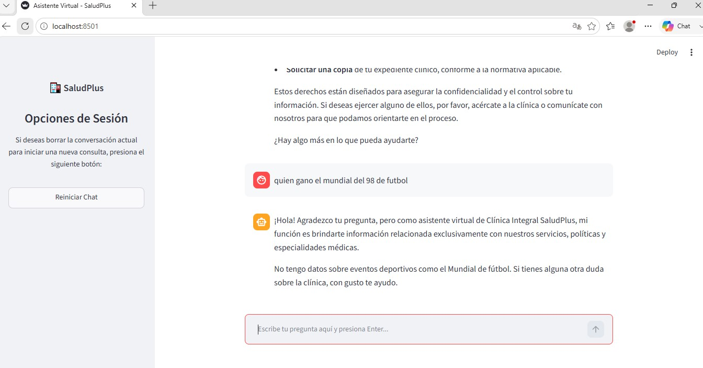

# Cl�nica Integral SaludPlus ??

Este proyecto implementa un sistema **RAG (Retrieval-Augmented Generation)** que responde preguntas utilizando exclusivamente la documentaci�n interna (Manual de Operaciones, Pol�ticas y Gu�as integrales) de la empresa ficticia **Cl�nica Integral SaludPlus**.

El aplicativo resuelve consultas sobre: pol�ticas de privacidad, derechos ARCO, consultas y turnos, entrega de resultados, pol�ticas de cancelaci�n, devoluciones, convenios, alertas de seguridad, directorio de sedes regionales, cat�logo de medicamentos exclusivos, costos de servicios, horarios, facturaci�n electr�nica, traslados en ambulancia, descuentos especiales y gu�a de admisi�n.

---

## ?? Objetivo

Desarrollar e implementar un asistente virtual capaz de:
* **Consultar** documentaci�n interna estructurada en formato PDF.
* **Analizar** el documento de forma sem�ntica para extraer la respuesta correcta.
* **Generar** respuestas fundamentadas estrictamente en dicho documento.
* **Evitar** alucinaciones o respuestas inventadas si la informaci�n no existe en el archivo.

---

## ?? Estado del Proyecto

* **Estado:** Finalizado, desplegado y en producci�n. ??

---

## ? Caracter�sticas

* **Lectura de PDFs:** Procesa el Manual de Operaciones, Pol�ticas y Gu�as Integrales.
* **Generaci�n Avanzada:** Respuestas potenciadas por los modelos de Google Gemini.
* **Restricci�n de Contexto:** Respuestas basadas *�nicamente* en la informaci�n del PDF.
* **Interfaz de Usuario:** Entorno web amigable desarrollado con Streamlit.

---

## ??? Arquitectura y Flujo

El sistema se basa en una arquitectura RAG est�ndar. Si la pregunta del usuario no encuentra coincidencia en el PDF, el sistema lo detecta y le invita a reformular su consulta.



---

## ??? Tecnolog�as Utilizadas

* **Lenguaje:** Python 3.14.6
* **Frontend:** Streamlit
* **Orquestaci�n LLM:** LangChain
* **Modelo Inteligencia Artificial:** Google Gemini
* **Gesti�n de Entorno:** Python-dotenv

---

## ?? Instalaci�n

Sigue estos pasos para configurar el proyecto en tu entorno local:

1. **Clonar el repositorio:**
   ```bash
   git clone https://github.com
   ```

2. **Ingresar al directorio del proyecto:**
   ```bash
   cd orquestador-pdf
   ```

3. **Crear un entorno virtual:**
   ```bash
   python -m venv .venv
   ```

4. **Activar el entorno virtual:**
   * En Windows:
     ```bash
     .venv\Scripts\activate
     ```
   * En Linux/macOS:
     ```bash
     source .venv/bin/activate
     ```

5. **Instalar las dependencias:**
   ```bash
   pip install -r requirements.txt
   ```

6. **Configurar las variables de entorno:**
   Crea un archivo llamado `.env` en la ra�z del proyecto y agrega tu clave de API de Gemini:
   ```env
   GEMINI_API_KEY=tu_clave_api_key_aqu�
   ```

---

## ?? Execution

Una vez instaladas las dependencias y configurada tu API Key, inicializa la aplicaci�n con el siguiente comando:

```bash
streamlit run app_web.py
```

Inmediatamente se abrir� tu explorador web con la interfaz gr�fica para comenzar a interactuar.

---

## ?? Ejemplos de Consultas

Puedes probar el sistema realizando preguntas como:
* �Costo de consultas?
* �Reembolsos?
* �Agendar consultas?
* �Traslados en ambulancia?
* �Pol�tica de privacidad del paciente?
* �Entrega de resultados?
* �Pol�tica de cancelaciones?
* �Devoluciones?
* �Gu�a de convenios?
* �Sedes alternas?
* �Costo de imagenolog�a avanzada?
* �Facturaci�n electr�nica?
* �Pol�tica de descuentos?
* �Gu�a de admisi�n?
* �Protocolos de alta m�dica?

---

## ?? Capturas de Pantalla

### 1. Interfaz Principal
Al iniciar la aplicaci�n, el usuario es recibido por un entorno limpio en Streamlit que invita a realizar consultas sobre los servicios m�dicos de la cl�nica.



### 2. Respuestas Basadas en el Contexto (RAG Activo)
Cuando el usuario realiza una pregunta v�lida (como consultar sobre los Derechos ARCO), el sistema extrae la informaci�n del documento PDF y genera una respuesta precisa y estructurada en vi�etas.



### 3. Control de Contexto y Seguridad (Filtro Anti-Alucinaci�n)
Si el usuario intenta hacer una consulta ajena a la cl�nica (por ejemplo, sobre el mundial de f�tbol), el modelo restringe la respuesta de forma segura y le recuerda al usuario interactuar �nicamente con base en la documentaci�n institucional.



---

## ?? Autor

* **Miguel Ibarra Miramar** - [GitHub](https://github.com)
